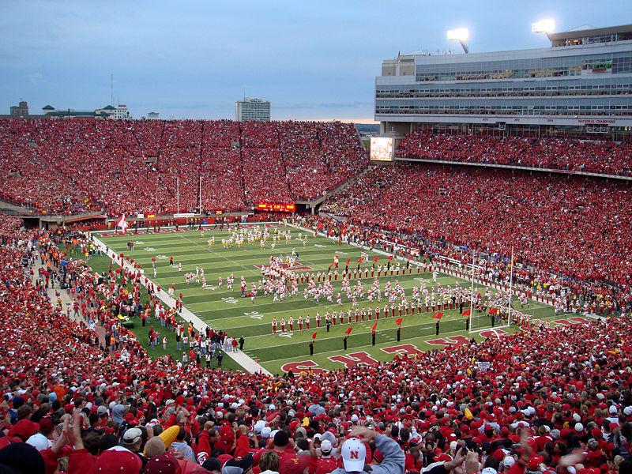
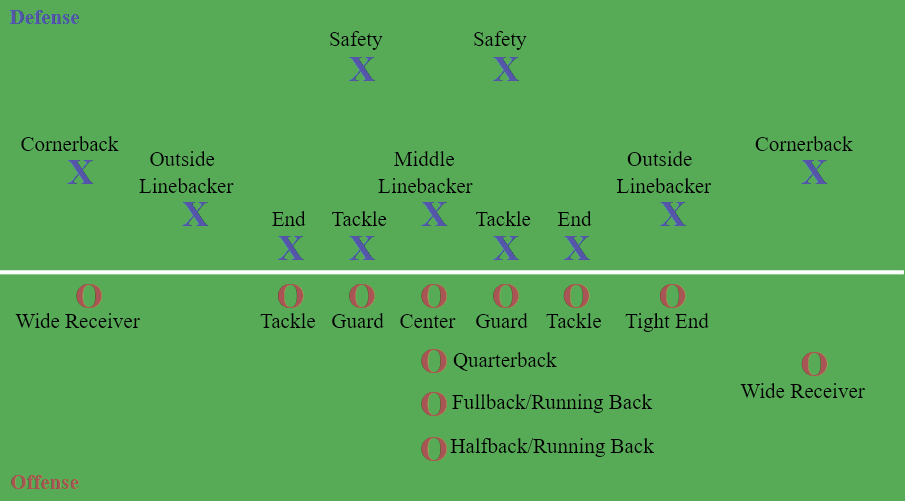
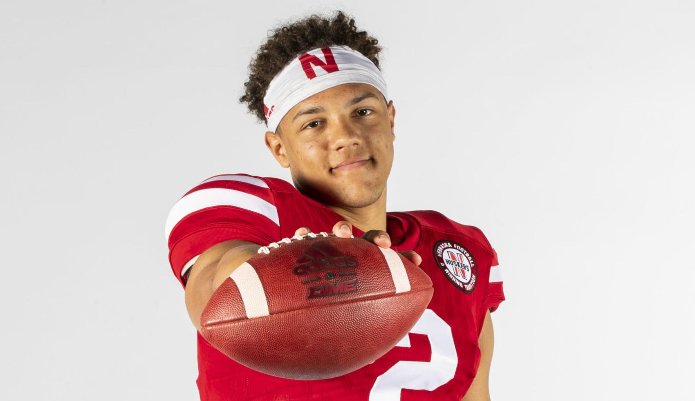

```{r setup, include=FALSE}
knitr::opts_chunk$set(echo = FALSE)
```

```{r include=FALSE}
# Libraries used
library(dplyr)
library(tidyverse)
library(tidyr)
```
## Go-Big-Red
{width=40%}

## Stadium
{width=85%}

## Nebraska Cornhuskers Team
{width=85%}

## American Football Positions
{width=99%}

## DataSets
1. Player Salary
2. Coach Salary
3. Coach Record

## Player Salary Variables
**Position**: position played by the player   
**Player**: name   
**Team**: team the player in   
**Age**: age     
**Total_Value**: total amount of money on the contract  
**Ave_Year**: yearly averaged salary  
**Total_guaranteed**: players could get this amount of money after they serve several years for the team   
**Fully_guaranteed**: money guaranteed to get regardless of what happens    
**Free_agency**: time when the contract of the player expires 

## Coach Salary Variables
**name**: name of the coach  
**team**: team the coach works for  
**division**: division of the team  
**annual salary**: annual salary   
**net worth**: Total sum of property   
**position**: position of the coach 

## Coach Record Variables
**name**: name of the coach  
**Team**: team the coach works for  
**seasons**: seasons the coach coaches   
**Gms**: games Coached  
**W**: games Won  
**L**: games Lost  
**T**: games Tied  
**Yrs**: seasons as head coach  
**post**: number of postseason appearances as head coach  
**pct**: winning Percentage  
**DIV**: division Championships  
**CON**: conference Championships  
**LG**: league Championships  
**SB**: super Bowl Championships 

## Average salary of each position

```{r cars, echo = TRUE}
player_salary <- read.csv("player_salary.csv",header = T)
posSa <- player_salary %>% group_by(player_salary$position) %>%
  summarise(avg <- mean(total_value))
posSa <- as.data.frame(posSa)
posSa[order(posSa$`avg <- mean(total_value)`,decreasing=T),]
```

## Number of players of each position

```{r pressure, echo = TRUE}
frequency <- player_salary %>% group_by(player_salary$position)%>%
  summarise(n = n())
frequency <- as.data.frame(frequency)
frequency[order(frequency$n,decreasing = T),]
```

## Average salary of each team
```{r, echo = TRUE}
teamSa <- player_salary  %>% group_by(player_salary $team) %>%
  summarise(avg <- mean(total_value))
teamSa <- as.data.frame(teamSa)
teamSa[order(teamSa$`avg <- mean(total_value)`,decreasing=T),]
```

## Average salary of each age group
```{r, echo = TRUE}
ageSa <- player_salary  %>% group_by(player_salary $age) %>%
  summarise(avg <- mean(total_value))
ageSa <- as.data.frame(ageSa)
ageSa[order(ageSa$`avg <- mean(total_value)`,decreasing=T),]
```


## Expolore total value among different age groups
```{r, echo=FALSE}
corAge <- ggplot(data=player_salary ,aes(x=age,y=total_value))+xlim(0, 70)+geom_point(color ="darkgreen")
corAge
```

## Is total value positively correlated with fully guaranteed?
```{r}
cor(player_salary$total_value,player_salary$fully_guaranteed)
corValue <- ggplot(data=player_salary ,aes(x=total_value,y=fully_guaranteed))+
  geom_point(color ="darkgreen")
corValue
```

```{r include=FALSE}
player_salary <- read.csv('Pres.csv')
head(player_salary)
```

## What are the variables related to high **annual salary** of players?
- **Position**  
&ensp; - Average income  
&ensp; - top-income players  
- **Age**
&ensp; - Top-income Players Age Distribution  
&ensp; - Overall-income Players Age Distribution  
- **Team**
&ensp; - How annual salary varies with team    
&ensp; - Ram Cowboy and overall average  

## Position
### Average income  
* Outliers : extraordinarily highly paid players  
* highest averaged yearly pay : **quarterback**

```{r warning=FALSE}
# unique(player_salary$position)#24 positions in the data

# Select columns of position, avg_year, player to find positions with the highest salary

position_sub<- player_salary[c('position','avg_year')]%>%
  group_by(position)

p <- position_sub %>%
      summarize_each(funs(mean)) %>%
      arrange(desc(avg_year)) %>%
      head(10) %>%
      select(position) %>%
      inner_join(position_sub, by='position') %>% 
      group_by(position) %>%
      ggplot(aes(x=position, y=avg_year))+
      geom_boxplot(aes(fill=avg_year)) +
      theme(axis.text.x = element_text(angle=90, hjust = 1))
p + stat_summary(fun=mean, color='darkred', geom='point')+
  ylab("Average annual salary") #red dot identifies the mean value
```

## Position
### Zoom in   
* quarterback : almost million
* 4-3 outsider linebacker : still top 10/24  
* medians are close to the the bottom : very few of the players get extraordinarily high annual income

```{r}
p + stat_summary(fun=mean, color='darkred', geom='point') +
    coord_trans(x = "identity", y = "identity", xlim = NULL, ylim = c(0,6e+6))+
  ylab("Average annual salary")

```

## Position
### Top highest in each position
*  quarterback : still the highest yearly pay

```{r}
top_10_each_position <- position_sub %>%
                          summarize_each(funs(mean)) %>%
                          arrange(desc(avg_year)) %>%
                          head(10) %>%
                          select(position) %>%
                          inner_join(position_sub, by='position') %>% 
                          group_by(position) %>%
                          slice_max(order_by = avg_year, n = 10)

ggplot(top_10_each_position, aes(x=position, y=avg_year))+
      geom_boxplot() +
      theme(axis.text.x = element_text(angle=90, hjust = 1))+
  ylab("Average annual salary")

```

## Age 
### Top-paid Distribution
* Most in 25-31  
* mean around 29

```{r}
player_salary %>% group_by(position) %>% slice_max(order_by = avg_year, n = 10) %>%
  ggplot(aes(x=age)) + 
  geom_histogram(binwidth = 2,
                 color='black',
                 fill='white')+
   geom_density() +
   geom_density(alpha=.2, fill='#FF6666')+
   geom_vline(aes(xintercept=mean(age, na.rm=T)),
               color="red", linetype="dashed", size=1)+#red dash is the mean
  ylab("Age count") 
```

## Age (2)
### Overall distribution  
* Heavy right tail  
* In general, younger is preferred 

```{r}
player_salary %>%
  ggplot(aes(x=age)) + 
  geom_histogram(binwidth = 2,
                 color='black',
                 fill='white')+
   geom_density(alpha=.2, fill="#FF6666")+
   geom_vline(aes(xintercept=mean(age, na.rm=T)),
               color="red", linetype="dashed", size=1)+
  ylab("Age count")
```

## Team 
### Average team cost
```{r}
# Average
p <-player_salary[,c('team','avg_year')] %>% group_by(team) %>%
      summarize_each(funs(mean)) %>%
      arrange(desc(avg_year)) %>%
head(32) %>%
select(team) %>%
inner_join(player_salary[,c('team','avg_year')], by='team') %>%
group_by(team)%>%
ggplot(aes(x=team, y=avg_year))+
geom_boxplot(aes(fill=avg_year))+
theme(axis.text.x = element_text(angle=90, hjust = 1))
p + stat_summary(fun=mean, color='darkred', geom='point')+
  ylab("Average annual salary") #red dot identifies the mean value
```

## Team
### Average team cost (Zoom in)
```{r}
p + stat_summary(fun=mean, color='darkred', geom='point') +
    coord_trans(x = "identity", y = "identity", xlim = NULL, ylim = c(0,4e+6))+
  ylab("Average annual salary")
```

## Team
### Barplot to compare teamwise
* most: between 2 million and 2.5 million  
* Cowboy and Ram
```{r}
less_team <- player_salary[,c('team','avg_year')] %>% 
      group_by(team) %>%
      summarize_each(funs(mean)) %>%
      arrange(avg_year) %>%
      head(16) %>%
      select(team) %>%
      inner_join(player_salary[,c('team','avg_year')], by='team') %>%
      group_by(team) %>% 
      summarize_each(funs(mean)) %>% 
      mutate(Rate='Lo')
hi_team <- player_salary[,c('team','avg_year')] %>% 
      group_by(team) %>%
      summarize_each(funs(mean)) %>%
      arrange(desc(avg_year)) %>%
      head(16) %>%
      select(team) %>%
      inner_join(player_salary[,c('team','avg_year')], by='team') %>%
      group_by(team) %>% 
      arrange(desc(avg_year)) %>%  
      summarize_each(funs(mean)) %>%
      mutate(Rate='Hi')
hi_low_team <- rbind(hi_team, less_team)

ggplot(hi_low_team, aes(x=team, y=avg_year))+
  theme(axis.text.x = element_text(angle=90, hjust = 1))+
  geom_bar(stat = 'identity')+
  ylab("Average annual salary")
  # facet_grid(. ~ Rate)
```


## Team
### Ram, Cowboy and all
* all: mostpaid position quarterback  
* Cowbiy and Ram: defensive line, left tackle, and right tackle
```{r}
all_team <- player_salary[,c('avg_year', 'position')]  %>% 
                group_by(position) %>%
                summarise_each(funs(mean))%>%
                mutate(Distr = 'All')

Cowboy_team <- 
            player_salary[player_salary$team=='Cowboys' ,c('avg_year', 'position')]%>% 
                group_by(position) %>%
                summarise_each(funs(mean))%>%
                mutate(Distr ='Cowboy')

Rams_team <- player_salary[player_salary$team=='Rams' ,c('avg_year', 'position')] %>% 
                group_by(position) %>%
                summarise_each(funs(mean))%>%
                mutate(Distr ='Rams') 

position_team <- rbind(all_team, Cowboy_team, Rams_team)
ggplot(position_team, aes(x=position, y=avg_year))+
  theme(axis.text.x = element_text(angle=90, hjust = 1))+
  geom_bar(stat = 'identity')+
  facet_grid(Distr ~ .)+
  ylab("Average annual salary")
```

## Number of free agency players by year

```{r, include=FALSE}
# Libraries used
library(dplyr)
library(tidyverse)
library(tidyr)
library(ggplot2)

# Getting data
player_salary <- read.csv("player_salary_slide.csv",header = T)
coach_salary <- read.csv("coach_salary_slide.csv",header = T)
coach_record <- read.csv("coach_record_slide.csv",header = T)


# Cheking how many player will be free agency by 2022
df_free <- player_salary %>% dplyr::filter(agency_time >= 2022)
nrow(df_free)

# Plotting
df_agency <- player_salary
df_agency$agency_time <- as.factor(df_agency$agency_time)
```

```{r}
ggplot(df_agency, aes(x= agency_time, color="agency_time")) +
    geom_bar(stat = "count", fill="white", color="blue") +
    labs(x = "Free Agency") +
  #ylim(0, 2500) +
  scale_y_continuous(breaks = seq(0, 2500, by = 250))
```  

- There will be 2208 free agency players by 2022 

## 20 MVP players

```{r, include=FALSE}
# Creating column with MVP value 
df_MVP <- player_salary %>% 
  rowwise() %>% 
  mutate(MVP_value = sum(avg_year, total_guaranteed, fully_guaranteed))

# Removing duplicated players'name
df_MVP <- df_MVP %>% distinct(player, .keep_all= TRUE)
# Organizing it by sorting as ascending values
df_MVP <- df_MVP[order(df_MVP$MVP_value),]
# Extracting the 20 highest MVP_values
df_20 <- tail(df_MVP, n= 20)
# The 20 most valuable players (MVP) are:
df_20$player
# Which position has more MVP's?
df_20$position <- as.factor(df_20$position) # making position as factor

# Removing duplicated players'name
df_MVP <- df_MVP %>% distinct(player, .keep_all= TRUE)

# Organizing it by sorting as ascending values
df_MVP <- df_MVP[order(df_MVP$MVP_value),]

# Extracting the 20 highest MVP_values
df_20 <- tail(df_MVP, n= 20)

# The 20 most valuable players (MVP) are:
df_20$player

# Which position has more MVP's?
df_20$position <- as.factor(df_20$position) # making position as factor
```
```{r}
df_20 <- as.data.frame(df_20)
df_20 %>%  arrange(desc(MVP_value)) %>% select("player", "position", "team")
```

## Position relationship with MVP's  

```{r}
ggplot(df_20, aes(x= position, color= position, fill= position)) +
    geom_bar(stat = "count") +
    labs(x = "Position") +
  theme(legend.position = "none")
```  

- The position that shows more MVP's is the quarterback.  

## Teams with highest fully guaranteed expenses

```{r}
# Grouping by teams
library(dplyr)
df_fully <- player_salary %>% group_by(team) %>% dplyr::summarize(fully_guaranteed_mean=(mean(fully_guaranteed)))

ggplot(player_salary, aes(x= reorder(team, +fully_guaranteed), y=fully_guaranteed, color= team, fill= team)) +
    geom_col() +
    labs(x = "Team", y= "Fully guaranteed expenses ($)") + 
  theme(legend.position = "none") +
    coord_flip()
```  

- The Bears team has the highest fully guaranteed expenses (~4,2 M dollars), followed by Red Skins (~4,1 M dollars) and Browns (~3,8 M dollars).

## Relationship between coach records and their salaries

```{r, include=FALSE}
coach_record <- rename(coach_record, name = Name)
df_coach <- coach_record %>% merge(coach_salary, by = "name", all.x = TRUE)  %>% 
  na.omit()
```  

```{r}
ggplot(df_coach, aes(x= Pct*100, y=Annual_salary, color=name)) +
    geom_point(size=4, alpha=0.6) +
    labs(x = "Wins (%)", y= "Salary ($)") + 
  theme(legend.position = "none") +
  coord_trans(x= "identity", y= "identity", xlim= NULL,  ylim= c(0, 10e+6 )) 
``` 

## Thank you!
{width=40%}
