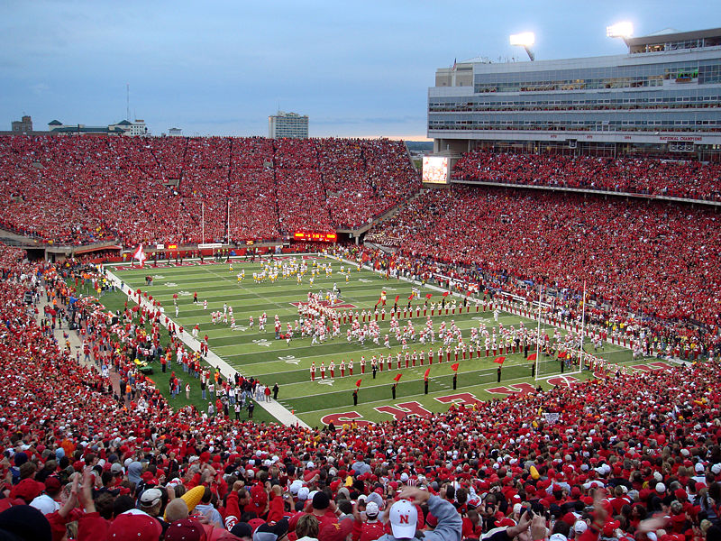
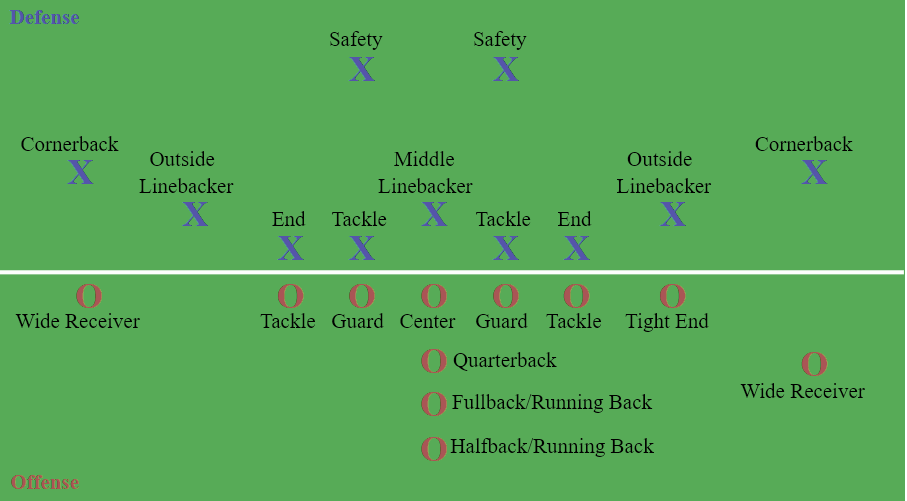

```{r setup, include=FALSE}
knitr::opts_chunk$set(echo = FALSE)
```

## Go-Big-Red
{width=40%}

## Stadium
{width=85%}

## Nebraska Cornhuskers Team
{width=85%}

## American Football Positions



## Slide with R Output

```{r cars, echo = TRUE}
summary(cars)
```

## Slide with Plot

```{r pressure}
plot(pressure)
```

##
